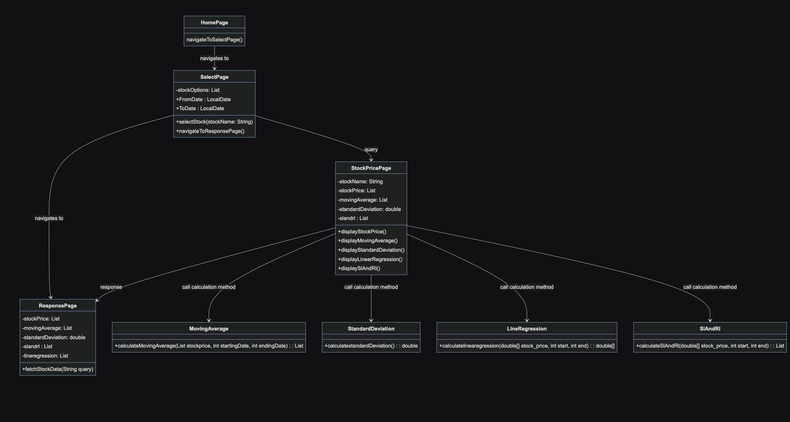

# NCKU PROGRAMMING DESIGN 2 FINAL PROJECT

## Description

***Stock website*** 
a lot more to go... 
All updates of final project progress will be on here! 

## Table of Contents
- [Installation](#installation)
- [Usage](#usage)
- [Reference](#reference)

## Installation

[jsoup.jar](https://jsoup.org/download)

## Usage

## Reference
>